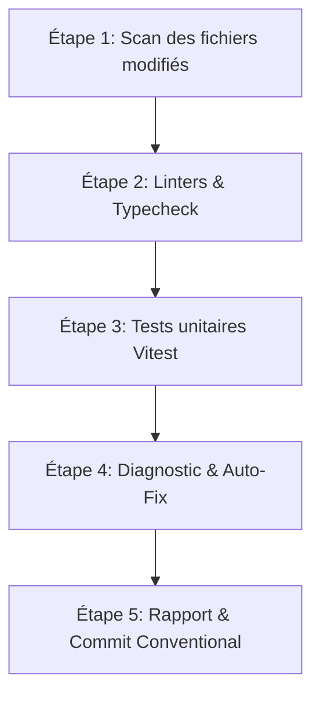

# Workflow: Revue de Code Locale, Typecheck & Auto-Fix avant Commit

Ce workflow réutilisable décrit la procédure systématique que l'agent doit exécuter à la demande pour auditer le code local, vérifier sa conformité technique, exécuter les tests et formuler des corrections automatiques avant de préparer un commit.

---

## Vue d'Ensemble du Workflow



---

## Étapes de Réalisation

### Étape 1 : Analyse des Modifications Locales (Scan)
L'agent doit d'abord identifier tous les fichiers modifiés et comprendre les périmètres impactés par le travail en cours.
Commandes à exécuter :
```bash
# Lister les fichiers modifiés et nouveaux
git status

# Afficher les différences exactes pour repérer d'éventuels résidus de debug
git diff
```

### Étape 2 : Vérification du Formatage et des Types (Lint & Typecheck)
Vérifiez que le code respecte les contraintes strictes de typage et les règles syntaxiques locales (pas de points-virgules, typage explicite aux frontières).
Commandes à exécuter :
```bash
# Lancer la vérification de type globale sur l'ensemble du monorepo via Turbo
pnpm typecheck

# Optionnel : Lancer le linter
pnpm lint
```

### Étape 3 : Exécution de la Suite de Tests Unitaires (Vitest)
Assurez-vous qu'aucune régression fonctionnelle n'a été introduite dans les modules logiques, notamment dans le parseur ou le moteur de prix.
Commande à exécuter :
```bash
# Exécuter l'intégralité des tests unitaires
pnpm test
```

### Étape 4 : Analyse des Erreurs et Corrections Automatiques (Auto-Fix)
Si des erreurs surviennent aux étapes 2 ou 3 :
1. **Erreurs de Type TS** : Identifiez les divergences entre les définitions dans `packages/types` et leur implémentation réelle dans le code. Ajustez les interfaces ou le code consommateur en appliquant le Skill `type-sync`.
2. **Échecs de Tests** : Examinez le fichier de test en cause, vérifiez si les fixtures de test de `packages/ao-parser/src/__tests__/fixtures.ts` doivent être adaptées ou si le parser a un bug de régression.
3. **Erreurs de Linter** : Corrigez automatiquement les problèmes de style (ex. suppression des points-virgules superflus, correction des guillemets).

### Étape 5 : Rapport de Validation et Préparation du Commit
Une fois que le typage et tous les tests passent avec succès, compilez un rapport récapitulatif pour l'utilisateur.

Proposez un message de commit conforme à la spécification **Conventional Commits** utilisée sur le projet (ex. `feat(web): ...`, `fix(database): ...`, `refactor(ao-parser): ...`) en incluant :
- Le type de modification.
- Le scope du monorepo affecté (ex. `database`, `web`, `ao-parser`, `types`).
- Une description concise.
- Une note sur les migrations de base de données ou imports de données requis le cas échéant.
